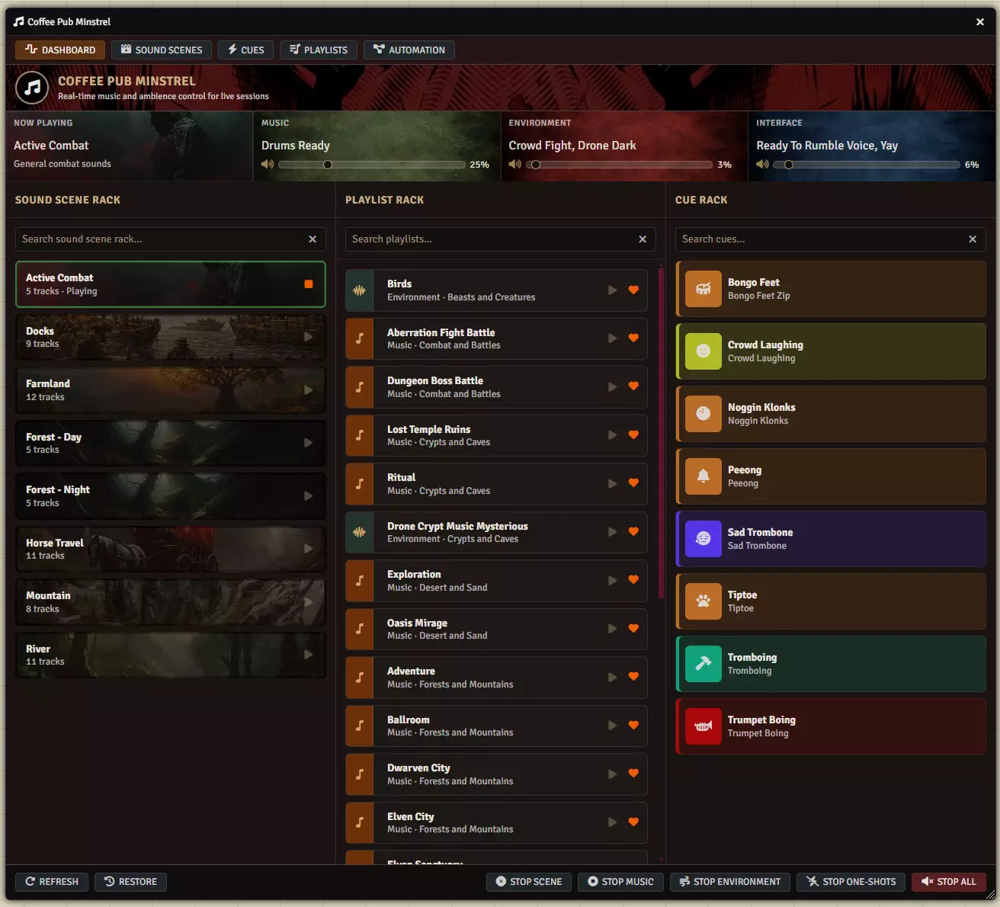

# Coffee Pub Minstrel

**Audience:** everyone -- GMs running a game with Minstrel, and contributors changing it.

The live-session audio console for Foundry VTT: start and stop music without hunting through the
playlist sidebar, build reusable ambient environments, fire dramatic cues, and let combat and scene
changes drive the soundtrack on their own. Minstrel is part of the Coffee Pub suite and requires
Coffee Pub Blacksmith.

This page routes. Each section points at the document that answers the question rather than answering
it here.

## Using Minstrel at the table

[Getting started](userguides/userguide-getting-started.md) covers what Minstrel does, what it needs
installed, and what changes on screen the moment it is enabled. Then one guide per tab:
[the Dashboard](userguides/userguide-dashboard.md) for running a session,
[sound scenes](userguides/userguide-soundscenes.md) for building reusable audio programs,
[cues](userguides/userguide-cues.md) for sounds you fire by hand,
[playlists](userguides/userguide-playlists.md) for your library, and
[automation](userguides/userguide-automation.md) for rules that change the soundtrack for you, and
[the menubar](userguides/userguide-menubar.md) for running a session without the window open.

## Working on Minstrel itself

[The architecture map](architecture/architecture-minstrel.md) is the entry point: how the managers
relate, the startup order and why it is that order, and the two facts that explain most of the
codebase. Each subsystem then has its own architecture document, listed in the sidebar --
[sound scenes](architecture/architecture-soundscenes.md),
[playback](architecture/architecture-playlists.md),
[automation](architecture/architecture-automation.md),
[cues](architecture/architecture-cues.md),
[the dashboard](architecture/architecture-dashboard.md),
[storage](architecture/architecture-storage.md), and
[the window and render pipeline](architecture/architecture-window.md).

Minstrel exposes no API to other modules; it is a leaf consumer of Blacksmith rather than a provider.
For the surfaces it builds on, see the
[Blacksmith wiki](https://github.com/Drowbe/coffee-pub-blacksmith/wiki).

## Known issues

Defects that are real and unfixed are in [known issues](known-issues.md).
