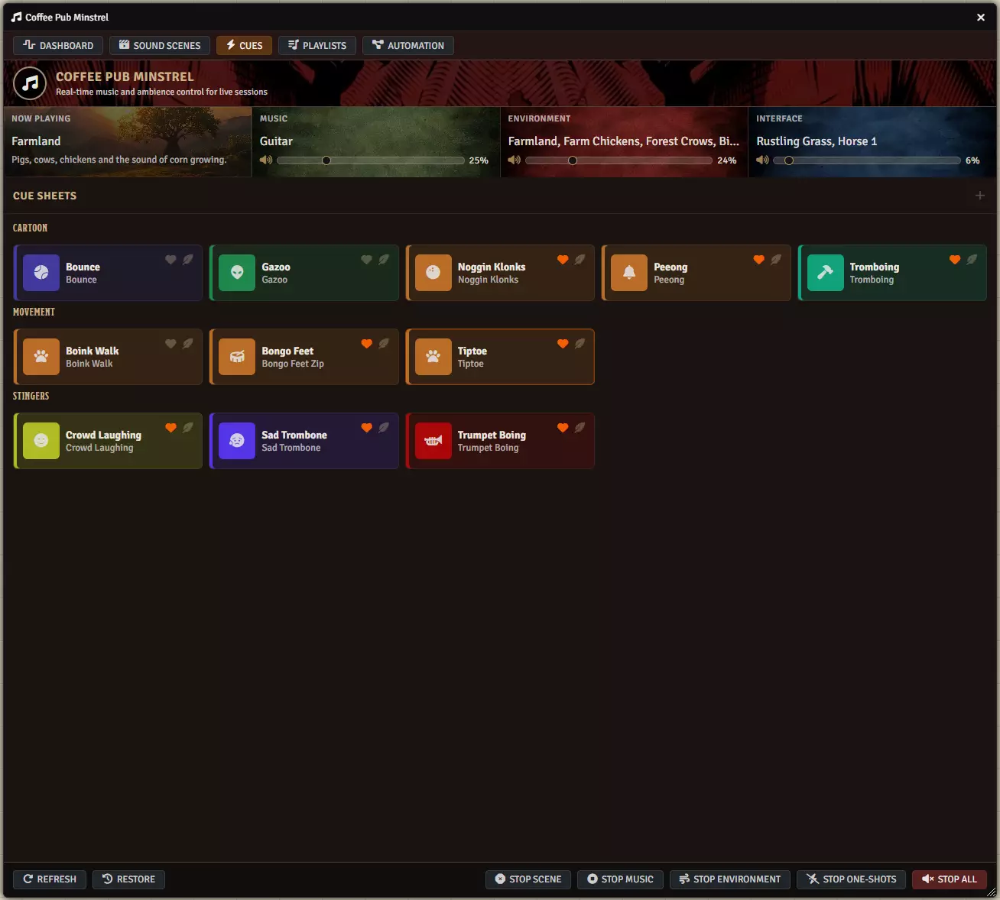
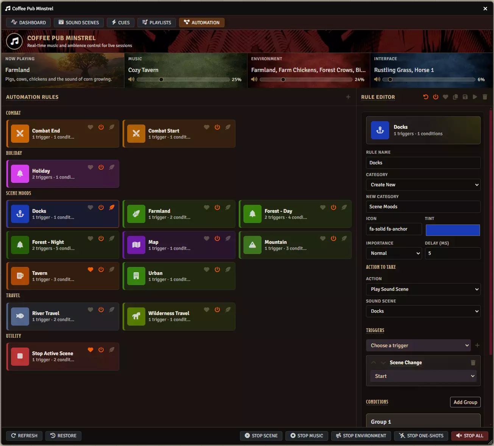

# Getting Started with Minstrel

**Audience:** the Gamemaster, in the first five minutes after enabling Minstrel.

What Minstrel does, what it needs installed, and what appears on screen once it is on.

## What Minstrel is for

Minstrel is an audio console for running a session. Instead of hunting through the Playlists sidebar
mid-scene, you get one window with your music, your ambience, and your sound effects laid out the way
you actually use them -- plus rules that can change the soundtrack for you when combat starts or the
party moves to a new map.

Your audio still lives in ordinary Foundry playlists. Minstrel plays and stops those sounds; it does
not import, copy or convert your files, and everything you build stays visible in the Playlists
sidebar.

## What you need

- Foundry VTT version 13.
- Coffee Pub Blacksmith, installed and enabled. Minstrel will not run without it.
- At least one playlist with some sounds in it.

## Minstrel is Gamemaster only

Only the Gamemaster can open or use Minstrel. Players see nothing -- no window, no toolbar button, no
menu. If a player tries, they are told "Only the Gamemaster can use Coffee Pub Minstrel."

The audio itself still reaches everyone, because Minstrel plays normal Foundry playlist sounds.

## What appears when you enable it

Two things, both Gamemaster only:

- A music note button in the Foundry toolbar, which opens the Minstrel window.
- A Minstrel bar in the Blacksmith menubar, showing the active sound scene and what is playing, with
  buttons to stop music, environment, one-shots, or everything.

## The five tabs

They sit across the top of the window in this order: Dashboard, Sound Scenes, Cues, Playlists,
Automation.

**Dashboard** is where you start a session. Across the top are four readouts -- Now Playing, Music,
Environment and Interface -- each with its own volume slider. Below them are three racks: Sound Scene
Rack, Playlist Rack and Cue Rack, each with its own search box. Anything you mark as a favourite
elsewhere appears in these racks, so the things you use most are one click away.

**Sound Scenes** is the heart of the module. A sound scene is a reusable audio program you build once
and start with one click -- music, background ambience, and occasional sound effects, all together. A
tavern scene might be a music track, a crowd murmur looping underneath, and a door slam every couple
of minutes.

The tab has three columns: your scenes on the left, a Sound Selector in the middle for finding tracks
to add, and Sound Scene Details on the right. The details pane opens with a Master Timeline showing
the scene's aggregate run time, then the Music and Environment layers, each with its own volume and
length.

**Cues** are one-shot sounds you fire by hand at the moment you want them: a horn, a scream, a thunder
crack. Cues can duck the music underneath them so the effect lands, and can carry a cooldown so a
double click does not fire the sound twice. They are grouped into cue sheets under headings you name,
and every cue takes an icon and a colour so you can find it fast mid-session.

**Playlists** is your whole audio library, the same sounds you would see in the Foundry sidebar. One
search box matches tracks, playlists, paths and channels. Each playlist shows its channel and playback
mode; each track shows its state, channel and file path, with volume, repeat, play and favourite
controls on the row.

**Automation** is where you write rules. A rule watches for something happening -- combat starting, a
round ending, the party arriving on a new map, a particular time of day in the game world -- and
starts or stops a sound scene when it does. Rules are grouped into categories you name yourself, and
the Rule Editor on the right sets the rule's name, category, icon, tint, importance and delay, the
action to take, and the triggers and conditions that fire it.

## Your first five minutes

1. Open Minstrel from the toolbar.
2. Go to **Playlists** and find a track you like. Play it, to confirm sound is working.
3. Mark two or three tracks as favourites. They appear on the **Dashboard**.
4. Go to **Sound Scenes** and create one. Add a music layer and an environment layer, then activate
   it. Both start together, and the menubar shows the scene as active.
5. Stop it from the menubar, or from the action bar at the bottom of the window.

That is enough to run a session. Automation can wait until you have a few scenes worth switching
between.

## The three kinds of sound

Minstrel sorts everything by which Foundry channel a sound uses, and this is worth knowing because
the stop buttons work per channel:

| Foundry channel | In Minstrel | Used for |
|---|---|---|
| Music | Music | The main track, played one at a time |
| Environment | Environment | Background beds that loop under everything |
| Interface | Interface | Short effects that fire and finish: cues and scene one-shots |

If a sound is on the wrong channel in Foundry, Minstrel will treat it as the wrong kind. That is the
first thing to check if a track will not stop when you expect it to.

## Stop means stop

The stop buttons are not pause. **Stop Music** also cancels the scene's music sequence, so the next
track will not start on its own. **Stop Environment** cancels any layer that was waiting to fade in
later. **Stop One-Shots** cancels the timers for repeating effects and silences cues. **Stop All**
tears the whole scene down.

Once stopped, none of those timers come back until you activate the scene again.

## Settings

Three settings, in Configure Settings under Coffee Pub Minstrel:

- **Default Fade Seconds** -- the fade length Minstrel uses when it starts or stops a track and the
  scene does not specify its own.
- **Recent Track Limit** -- how many recently played tracks are remembered for the world.
- **Combat Restore Delay** -- how long Minstrel waits, in milliseconds, before restoring the previous
  audio once combat automation ends. Raise it if the music returns before the after-combat chatter
  has settled.

## If something is not working

Check that Coffee Pub Blacksmith is enabled first -- almost everything routes through it.

If audio does not start until you click something, that is Foundry, not Minstrel: browsers refuse to
play sound until you interact with the page. A scene that automation started will begin the moment
you click anything.

Defects we know about are in [known issues](known-issues.md).
