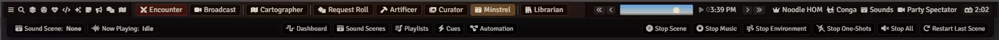
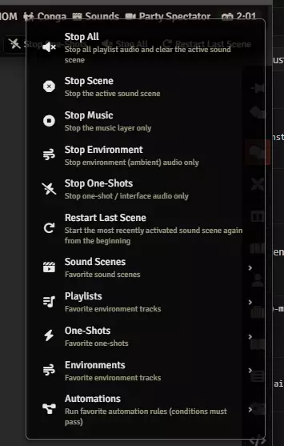

# Using the Minstrel menubar

**Audience:** the Gamemaster, running audio without the window open.

How to drive Minstrel from the Blacksmith menubar: the bar you will actually use mid-session, because
it needs no window and no clicks to get to. Everything here is Gamemaster only.

## Open the bar

Click **Minstrel** in the Blacksmith menubar. The Minstrel bar appears underneath it.

Only one Blacksmith bar is open at a time, so opening Minstrel's closes whichever was showing. Click
Minstrel again to close it.

## Read the bar

The left of the bar tells you what is happening without opening anything:

- **Sound Scene** names the active scene, or **None**.
- **Now Playing** names what is sounding, or **Idle**.

If those two disagree with what you are hearing, something is playing that is not part of a scene --
usually a track started from the Playlists tab. **Stop All** clears it.

## Jump to a tab

The middle of the bar has **Dashboard**, **Sound Scenes**, **Playlists**, **Cues** and
**Automation**. Each opens the Minstrel window on that tab, which is quicker than opening the window
and then finding the tab.

## Stop audio without opening anything

The right of the bar carries the same stop controls as the window's bottom bar:

| Control | Stops |
|---|---|
| **Stop Scene** | The active sound scene and its timers |
| **Stop Music** | The music channel, and the scene's music sequence |
| **Stop Environment** | The environment channel, and any layer waiting to start |
| **Stop One-Shots** | Repeating scene effects and any sounding cue |
| **Stop All** | Everything, and tears the scene down |

This is the reason to keep the bar open. When a player asks a question and you need silence now, it
is one click away with no window in front of the map.

## Restart the scene you just stopped

**Restart Last Scene** starts the most recently activated scene again from the beginning. Use it after
a Stop All that you regretted, or to reset a scene that has drifted somewhere you did not want.

If nothing has been activated yet this session it tells you so, and if the scene has since been
deleted or disabled it says that instead.

## The quick menu

Clicking the **Sound Scene** label opens a menu with everything above, plus submenus of your
favourites. This is the fastest route to starting something new without opening the window at all.

The five submenus each list what you have hearted elsewhere:

- **Sound Scenes** -- your favourite scenes. Pick one to start it.
- **Playlists** -- your favourite playlists.
- **One-Shots** -- your favourite cues. Pick one to fire it.
- **Environments** -- your favourite environment tracks.
- **Automations** -- your favourite automation rules. Picking one runs it, **but its conditions still
  have to pass.** A rule you run from here whose conditions are false does nothing, which is correct
  and occasionally surprising. If you want a scene unconditionally, start it from the Sound Scenes
  submenu instead.

A submenu is empty until you heart something for it, so if the menu looks bare, that is why -- go and
favourite the handful of things you want tonight.

Note that the **Playlists** submenu is currently described as "Favorite environment tracks", the same
description as the Environments entry. The submenu itself lists your favourite playlists correctly;
only the description line is wrong.
