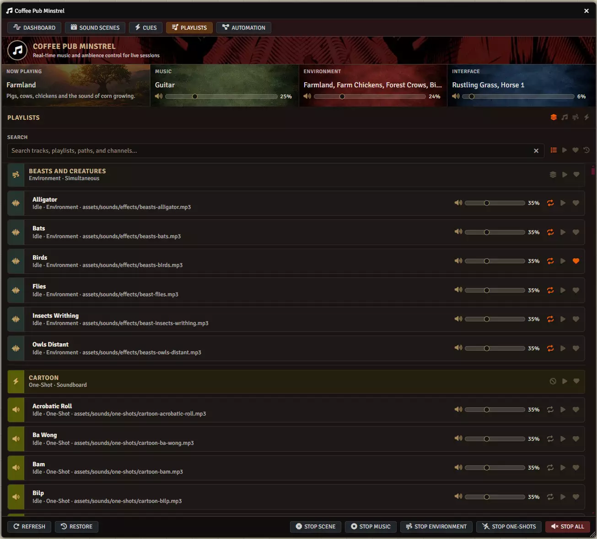

# Using the Playlists tab

**Audience:** the Gamemaster.

How to find, play and organise the audio in your world from the Playlists tab. Everything here is
Gamemaster only.

## What this tab is

Your whole audio library, the same playlists and sounds you would see in the Foundry sidebar. Nothing
here is a copy: playing a track from Minstrel is playing that track. Renaming or deleting it in
Foundry changes it here.

Use this tab to audition sounds, to mark the ones you want within reach, and to play something
one-off that does not deserve a scene.

## Find a sound

The search box matches **tracks, playlists, paths and channels** at once, so any of these work:

- part of a track's name
- part of the playlist's name
- part of the file path, which is useful when your files are named better than your tracks
- a channel name, to see everything on it

Three filter buttons narrow it further: **Favorites** shows only what you have hearted, **Recents**
shows what you have played lately, and **Playing** shows only what is sounding now. There are also
channel filters for **Music**, **Environment** and **Interface**, and an **All channels** button to
clear them.

Clear everything with the cross in the search box, or the clear-filters control.

## Play and stop a track

Click the play arrow on a track row. Click it again to stop.

A track played this way is independent of any sound scene. It will not be stopped when a scene ends,
which is occasionally what you want and occasionally a surprise -- if a sound is still playing after
you stopped a scene, this tab is where it came from. **Stop All** on the bottom bar catches it.

## Set a track's volume and looping

Every row has a volume slider and a percentage, which changes that track's volume in Foundry
immediately and permanently. The loop control next to it toggles whether the track repeats.

Both of these edit the underlying Foundry sound. If you want a different volume for one scene only,
set it on the layer inside that scene instead -- see the sound scenes guide.

## Mark what you want within reach

Click the heart on a track or a playlist to favourite it. Favourites appear in the Playlist Rack on
the Dashboard, which is where you want them during play.

Favourite a *playlist* when you will want several of its tracks and would rather pick at the table.
Favourite a *track* when you know exactly which sound you want.

## Change how a playlist plays

Each playlist header shows its channel and its playback mode. Clicking the mode cycles it through
Foundry's modes -- sequential, shuffle, simultaneous and soundboard. This is the same setting as in
the Foundry sidebar, so changing it here changes it everywhere.

**Simultaneous** suits environment beds, where you want several sounds layered. **Soundboard** suits
one-shot effects, where each sound is independent.

## Channels decide how a sound behaves

A track's channel is set in Foundry, not in Minstrel, and it decides which stop button reaches it:

| Channel | Used for | Stopped by |
|---|---|---|
| Music | The main track | Stop Music |
| Environment | Background beds | Stop Environment |
| Interface | Short effects | Stop One-Shots |

If a track will not stop when you expect it to, check its channel first -- that is nearly always the
answer.
