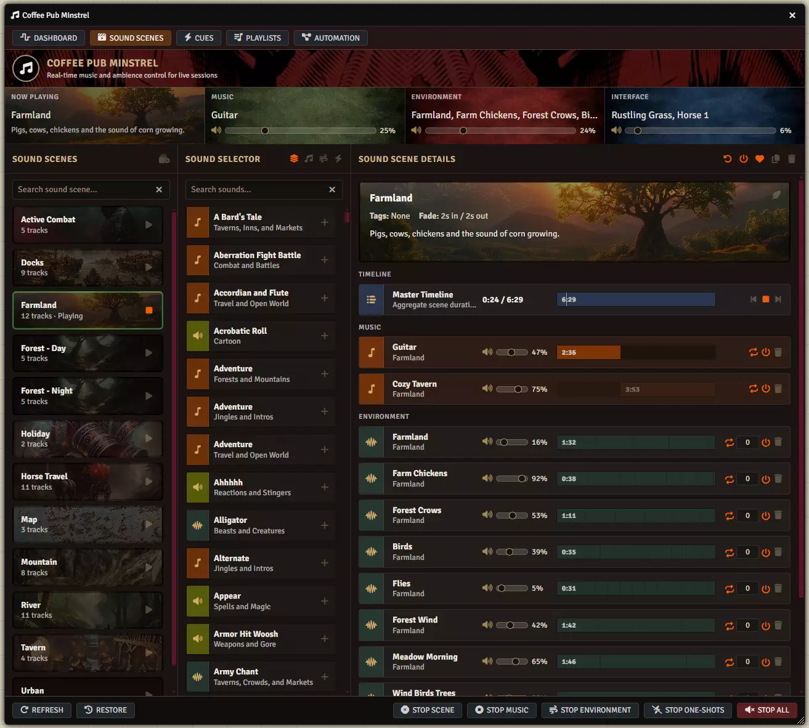

# Building and running sound scenes

**Audience:** the Gamemaster.

How to build a sound scene, tune it, and run it at the table. This is the tab that does the most for
you, and the one worth learning properly. Everything here is Gamemaster only.

## What a sound scene is

A reusable audio program you build once and start with one click. A tavern is a music track, a crowd
murmur looping underneath it, and a mug slam every couple of minutes -- three different kinds of
sound, started together, running until you stop them.

The tab has three columns: your scenes on the left, the **Sound Selector** in the middle for finding
tracks, and **Sound Scene Details** on the right for the scene you have selected.

## Build a scene from scratch

1. Click the plus at the top of the scene list, or **New Sound Scene**.
2. Give it a **Scene Name** and a **Description**. The description shows in the Now Playing readout
   during play, so write it for yourself mid-session: "Pigs, cows, chickens" beats "Farm ambience v2".
3. Find a track in the Sound Selector and click the plus on its row to add it as a layer.
4. Repeat for every sound the scene needs.
5. Set each layer's type, volume and timing -- see below.
6. Click the save control in the Sound Scene Details header.

The Sound Selector has its own search box and filter buttons for music, environment and one-shot
sounds, so you can narrow to the kind of layer you are adding. Click a sound's speaker to preview it
before committing.

## The three kinds of layer

What a layer does depends on its type, and the type decides which controls appear on its row.

**Music** layers play one at a time, in order. Add several and the scene works through them, moving
to the next when one ends, then returning to the first. This is how you get an hour of tavern music
out of four tracks without repetition being obvious.

**Environment** layers all start together and loop underneath everything. This is your rain, your
crowd, your wind. Give each one a **Delay** if you do not want them all arriving at once when the
scene starts.

**Scheduled One-Shots** fire on a timer rather than looping. Set how often, in seconds, and the sound
plays at that interval -- a distant wolf howl every ninety seconds, a mug slam every forty. Set the
loop control on the row to fire once instead of repeating.

## Tune a layer

Each layer row carries:

- **Volume**, as a percentage. This is the volume *inside this scene*, so the same track can be loud
  in one scene and quiet in another.
- **Delay**, in seconds, before it first plays.
- A loop control, deciding whether it repeats.
- An enable toggle, so you can silence a layer without deleting it while you are still tuning.
- Up and down controls to reorder, which matters for music because it sets the play order.

Use the trash control on the row to remove a layer.

## Read the timeline

The **Master Timeline** at the top of the details pane shows the scene's aggregate run time and, while
the scene is playing, a playhead moving through it. Each music layer shows its own length below.

This is how you judge whether a scene is long enough. A scene whose whole program is four minutes will
loop noticeably during a long encounter; add another music layer.

The transport beside the timeline plays and stops the scene, and skips to the previous or next music
track.

## Set fades and the scene card

In the details header:

- **Fade In** and **Fade Out**, in seconds, applied when the scene starts and stops. Two seconds is
  usually enough to stop a transition sounding abrupt.
- **Card Background**, an image for the scene's card in the list and on the Dashboard. Worth setting:
  during play you will recognise a picture faster than a name.
- **Tags**, comma separated, for your own organisation.
- **Restore previous playback on exit**, which returns to whatever was playing before this scene when
  you stop it.

## Run a scene at the table

Click the play control on a scene card, here or in the Dashboard's Sound Scene Rack. The card marks
itself Playing and the Now Playing readout changes.

Starting a *different* scene switches to it; you do not need to stop the first one. An environment
bed that both scenes share keeps playing rather than stopping and restarting, so the transition does
not stutter.

Stop with the same control, or **Stop Scene** on the bottom bar.

## Edit a scene while it is playing

You can. Changing a layer's volume takes effect immediately, which makes tuning during a quiet moment
practical. Adding or removing layers takes effect when the scene next starts.

## Copy a scene instead of rebuilding it

Use the duplicate control in the details header. Dawn, day, dusk and night versions of one location
are four scenes today, and duplicating then swapping the music is much faster than building each.

## Where scenes live

Each scene is an ordinary Foundry playlist named with a `[SOUND SCENE]` prefix, in a Sound Scenes
folder. You will see them in the Foundry sidebar and can safely ignore them there. Deleting one there
deletes the scene.
